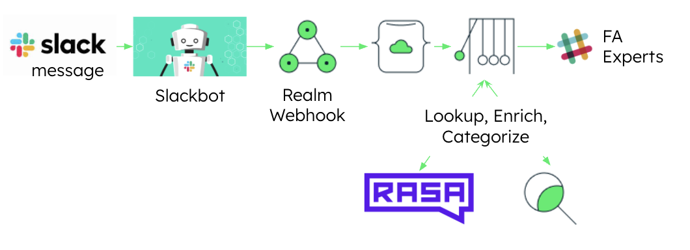

# Question Assistant Slack Bot (QASBr)

## Overview
QASBr is your friendly Slack assistant, working behind the scenes to route questions to experts in the appropriate Slack channel. 

## Architecture and Worflow

1. A question is typed in to Slack
2. The QASBr [Slackbot](https://slack.com/help/articles/202026038-An-introduction-to-Slackbot) calls a [Realm Weboook](https://docs.mongodb.com/realm/services/configure/service-webhooks/), which saves the Slack message to Atlas.
3. A [Realm Trigger](https://docs.atlas.mongodb.com/triggers/) forwards the message to the [RASA](https://rasa.com/) Natural Language Understanding (NLU) engine to associated the question with the appropriate focus area. The trigger than forwards the question to the appropriate Focus Area Slack channel.

